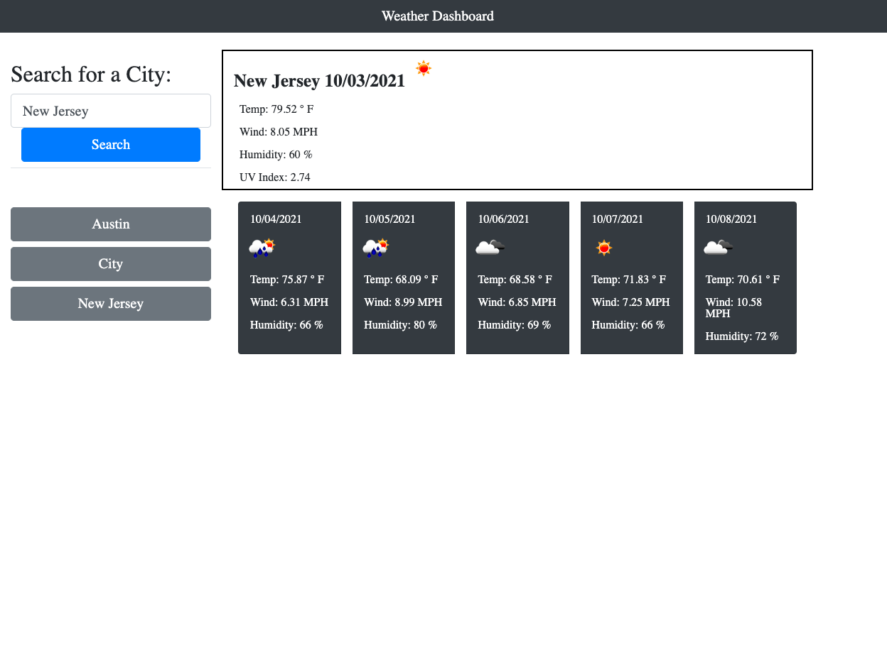

# HOMEWORK6_WEATHER_DASHBOARD
# Description
The purpose of this project was to create a weather dashboard that updated the weather
- When user searches for a city the API calls another API that calls for the lat and lon of a location
- In the main weather textbox it will display today's forecast
- In the section below it will display the forecast for the 5 following days
- Each time a search is made the city is stored in local storage and appened to the page so the user can toggle between the cities that were searched
# Link
https://christa-baccas.github.io/HOMEWORK6_WEATHER_DASHBOARD/
# ScreenShot

# Help / Assistance
- Tutor
- Study Group
- Ask BCS
